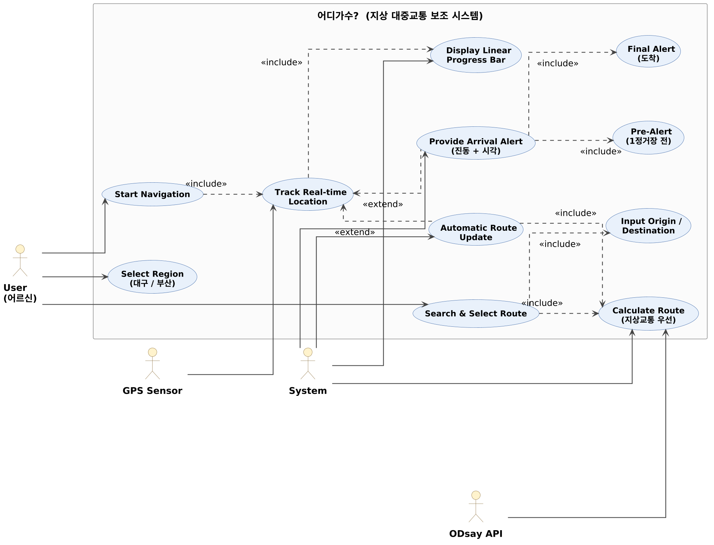
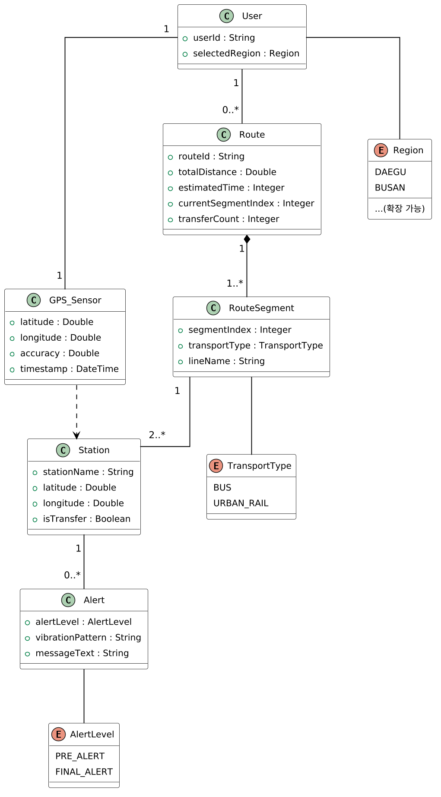
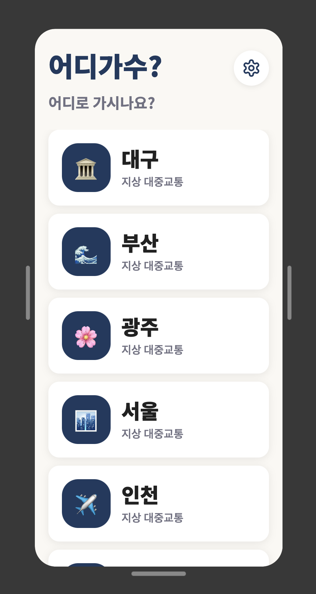

# [분석 보고서] 어르신 지상 대중교통 보조 시스템: 어디가수?

## Revision History

| Revision date | Version # | Description | Author |
| --- | --- | --- | --- |
| 2026-05-04 | 0.0.1 | 초기 분석 보고서 작성 완료 | 문찬주 |
| 2026-05-04 | 0.0.2 | UI 프로토타입 상세화 및 보고서 정리 | 문찬주 |

---

## Contents

1. Introduction
2. Use Case Analysis
3. Domain Analysis
4. Functional Decisions
5. User Interface Prototype
6. Glossary
7. References

---

## 1. Introduction

### 1) Summary

우리는 목적지에 가기 위해 대중교통을 이용한다. 하지만 신체적 노화로 인해 주의력이 감소한 노인들은 안내 방송을 놓치거나, 복잡한 노선도에 당황하여 하차 시점을 놓치는 곤란을 겪곤 한다. 기존 앱들은 젊은 층에 최적화되어 있어 노인들이 직관적으로 하차 시점을 인지하기 어렵다. 또한 지하 공간에서의 GPS 오차는 사용자에게 부정확한 정보를 제공할 위험이 크다.

이에 따라 "어디가수?"는 위치 추적의 신뢰도가 높은 **지상 대중교통**으로 범위를 한정하고, 노인들의 인지 특성을 반영한 직관적인 UI와 강력한 진동 알림을 제공하는 시스템을 고안했다. 이를 통해 노인들이 하차를 놓쳐 겪는 심리적 불안을 줄이고, 안전한 이동권을 보장하고자 한다.

### 2) Describe the features of project

- **지상 특화 경로 탐색:** 대구/부산 지역 내 지상 대중교통 중심의 최적 경로 계산.
- **실시간 지오펜싱(Geofencing) 알림:** 목적지 및 환승지 근접 시 화면 점유 알림 및 진동 피드백 제공.
- **통합 경로 진행 바:** 전체 경로와 현재 위치, 환승 지점을 하나의 선형 UI로 시각화.
- **위치 기반 자동 경로 업데이트:** 환승 지점 이동 후 별도의 조작 없이 GPS 위치에 따라 다음 안내 단계로 자동 전환.

---

## 2. Use Case Analysis

### 1) Use Case Diagram

** 어디가수? Use Case Diagram **

- **Actors:** User(어르신), System, GPS Sensor, ODsay API
- **핵심 Use Case:** Select Region, Search & Select Route, Calculate Route, Start Navigation, Track Real-time Location, Display Linear Progress Bar, Provide Arrival Alert(Pre-Alert / Final Alert), Automatic Route Update
- **관계 표기:** 항상 수행되는 하위 단계는 `<<include>>`, 조건부 발생(목적지 근접 / 환승 발생)은 `<<extend>>`

### 2) Use Case Description (핵심 사례 요약)

#### Use Case #1 : Search & Select Route

- **Summary:** 사용자가 지역을 선택하고 지상 대중교통 중심의 경로를 확인하는 기능
- **Primary Actor:** User
- **Preconditions:** 통신 가능 상태, 지역 선택(대구/부산) 완료
- **Main Success Scenario:**
  1. 사용자가 출발지와 도착지를 입력한다.
  2. 시스템은 외부 API를 호출하여 지상 대중교통 중심의 경로를 탐색한다.
  3. 시스템은 환승이 적은 경로를 큰 글씨로 정렬하여 표시한다.
  4. 사용자가 특정 경로를 선택하면 종료된다.

#### Use Case #2 : Provide Arrival Alert

- **Summary:** 하차 정류장 접근 시 진동과 시각적 알림을 제공하는 기능
- **Primary Actor:** System
- **Preconditions:** 실시간 위치 추적 모드 활성화
- **Main Success Scenario:**
  1. 시스템은 실시간 GPS 좌표와 목적지 좌표 사이의 거리를 계산한다.
  2. **[1정거장 전]** 하단 바텀 시트가 슬라이드 업되며 예고 진동을 발생시킨다.
  3. **[목적지 도착]** 화면 색상 반전 및 강력한 연속 진동을 발생시킨다.
  4. 사용자가 확인 버튼을 누르면 종료된다.

#### Use Case #3 : Automatic Route Update

- **Summary:** 환승 지점에서 사용자의 조작 없이 위치 정보를 통해 다음 안내로 전환하는 기능
- **Primary Actor:** System
- **Preconditions:** 환승이 포함된 경로이며 환승 지점 하차 알림이 발생한 이후여야 한다.
- **Main Success Scenario:**
  1. 사용자가 환승 지점에서 하차 후 다음 이동 수단으로 이동한다.
  2. 시스템은 백그라운드에서 실시간 위치를 지속적으로 추적한다.
  3. GPS 좌표가 환승 노선의 경로 상에 진입하거나 다음 정류장 반경 내에 도달함을 감지한다.
  4. 시스템은 별도의 사용자 입력 없이 다음 안내 구간으로 화면과 상태를 자동 업데이트한다.

---

## 3. Domain Analysis

### 1) [그림 3-1] Domain class diagram

### 2) [표 3-1] Description of Domain Classes

| Class Name | Description | Attributes (Public) |
| --- | --- | --- |
| **User** | 위치 정보 및 지역 설정을 관리하는 주체 | `currentLocation`, `selectedRegion` |
| **Route** | 전체 이동 경로 데이터 (자동 전환 로직 포함) | `totalDistance`, `currentSegmentIndex` |
| **Station** | 알림 및 자동 전환의 기준이 되는 지리적 지점 | `stationName`, `latitude`, `longitude` |
| **Alert** | 사용자에게 제공되는 시각/촉각 피드백 | `vibrationPattern`, `messageText` |

---

## 4. Functional Decisions

### 1) 역 검색 자동완성 여부: 예

역 검색 시 자동완성 기능을 제공하여 사용자가 입력하는 동안 실시간으로 관련 역 목록을 제안한다. 이는 노인 사용자의 입력 편의성을 높인다.

### 2) 주소-역 매핑 방식: 지오코딩 사용

사용자가 입력한 주소나 장소를 지오코딩 API를 통해 좌표로 변환하고, 가장 가까운 역을 매핑한다. 리버스 지오코딩은 역 선택 후 위치 확인에 활용한다.

### 3) 오프라인 캐싱 여부: 필요 시 역 데이터와 경로 정보 캐시

네트워크 연결이 불안정한 경우를 대비하여 최근 검색된 역 목록, 경로 데이터, 지도 타일을 캐시한다. 캐시는 주기적으로 업데이트된다.

### 4) 데이터 모델

- **역 정보:** 역 이름, 역 ID, 위도/경도, 지역(도/구) 정보
- **입력 필드:** 사용자가 입력하는 텍스트, 자동완성 제안 목록
- **API 응답 형식 예시:** 역 목록 배열 (예: `[{name: "역삼역", id: "123", lat: 37.5, lng: 127.0, region: "서울 강남구"}]`)

### 5) API 연계

- **외부 API 선택:** ODsay API의 역 검색 엔드포인트와 지오코딩 서비스 (예: Google Geocoding API)
- **요청 파라미터 형식과 응답 스키마:** 검색 쿼리 (역 이름 또는 주소), 응답으로 역 목록과 좌표 반환
- **에러 처리:** 미검색 시 "검색 결과가 없습니다. 다시 입력해주세요" 안내, 네트워크 실패 시 3회 재시도 후 오프라인 모드 전환

### 6) UI/UX

- **입력창 디자인:** 큰 글자와 단순 프롬프트 ("출발역을 입력하세요"), 자동완성 드롭다운을 입력창 바로 아래에 위치
- **역 선택 시 시각화:** 선택된 역의 위치를 지도에 표시하고, 경로 탐색을 초기화하여 다음 단계로 진행
- **노인 사용자 고려:** 입력 시 진동 피드백, 선택 시 명확한 음성/시각 신호 (예: "역삼역을 선택했습니다")

---

## 5. User Interface Prototype

### 1) UI Flow Diagram

지역 선택 → 출발지/도착지 입력 + 최근 검색 → 추천 경로 및 기타 경로 → 안내 페이지(실시간 위치/통합 바) → 동일 페이지에서 곧 내리세요 / 지금 내리세요

### 2) Screen Prototypes Description

- **Screen 1: Region Selection**
  
  - 지역 선택 버튼을 크게 배치하여 한눈에 서비스 가능 지역을 고를 수 있다.
  - `대구`, `부산` 등 현재 지원하는 지역이 명확히 표시된다.

- **Screen 2: Route Input**
  
  - 출발지와 도착지를 순서대로 입력하는 화면.
  - 입력창 바로 아래에 자동완성 제안이 표시되어 입력 부담을 줄인다.
  - 최근 검색 목록을 함께 보여줘서 자주 사용하는 역을 빠르게 선택할 수 있다.
  - 검색 결과가 없을 때는 `검색 결과가 없습니다. 다른 이름으로 검색해주세요.` 메시지를 보여준다.

- **Screen 3: Route Recommendation**
  
  - 추천 경로를 우선으로 보여주고, 대체 경로를 함께 제시한다.
  - 각 경로별로 환승 횟수, 총 이동 시간, 남은 정류장 수, 도보 거리 등을 요약해서 표시한다.
  - 사용자가 선택한 경로 아래에 `이 경로로 안내` 버튼을 배치하여 다음 단계로 자연스럽게 이동한다.

- **Screen 4: Navigation Guide**
  
  - 선택한 경로의 실시간 안내를 제공하는 화면.
  - 상단에 통합 경로 진행 바를 배치하고, 현재 위치를 시각적으로 표시한다.
  - 다음 정류장, 남은 정류장 수, 예상 도착 시간 등의 정보를 함께 보여준다.
  - 동일 화면에서 `곧 내리세요`와 `지금 내리세요` 상태를 텍스트/색상/진동으로 단계적으로 전환한다.

- **Screen 4-1 : Arrival Alarm**
  
  - 하차 직전 및 도착 시에 표시되는 알림 화면.
  - 바텀 시트가 위로 올라오고, 큰 글씨와 색상 변화로 시각적 주의를 유도한다.
  - 진동과 음성 안내를 함께 제공하여 사용자가 즉시 하차 준비를 할 수 있도록 돕는다.
  
- **Screen 4-2 : Arrival Alert**
  
  - 최종 도착시 표시되는 알림 화면.
  - 화면 전체가 적색으로 변환, 큰 글씨와 색상 변화로 시각적 주의를 유도한다.
  - 확인 버튼을 통해 최종 경로 종료를 선언 할 수 있다.

---
## 6. Glossary
| 용어 | 설명 |
| --- | --- |
| **Geofencing** | 특정 위도/경도 반경 내 진입을 감지하여 알림을 트리거하는 가상 경계 기술 |
| **Bottom Sheet** | 화면 하단에서 위로 슬라이드되어 중요 정보를 전달하는 UI 컴포넌트 |
| **Linear Progress Bar** | 출발부터 도착까지의 전체 경로를 하나의 선으로 표현한 통합 진행 바 |
| **Auto-Transition** | 사용자 개입 없이 GPS 좌표 변화만으로 시스템 상태를 다음 단계로 전환하는 로직 |

---

## 7. References

1. **ODsay API:** 지상 대중교통 경로 및 위치 데이터 활용 가이드
2. **W3C Geolocation API:** 실시간 좌표 수집 표준 명세
3. **Google Web Storage:** 최근 검색 기록 및 사용자 설정 저장 방식 참조
4. **MDN Web Docs:** Vibration API를 활용한 촉각 피드백 구현 지침
