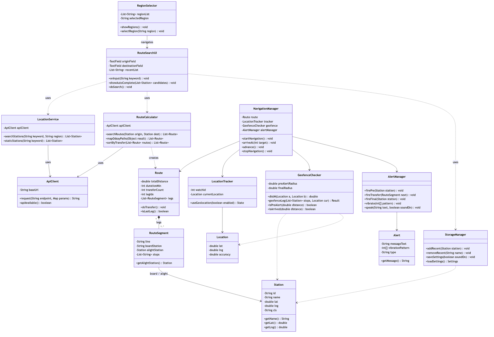
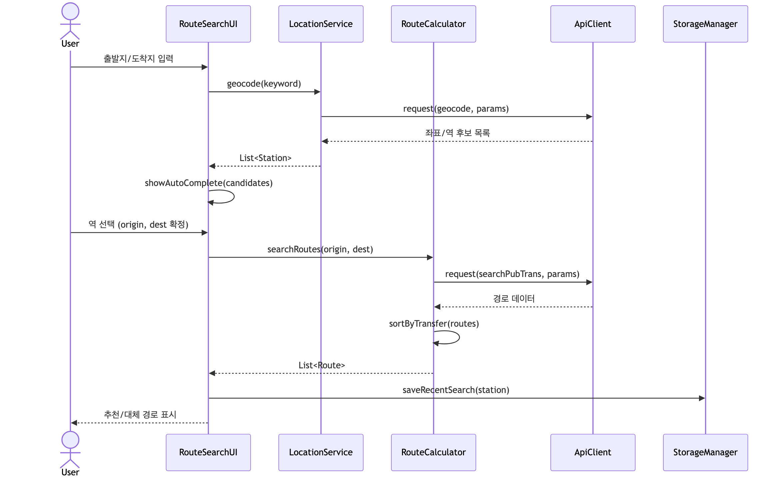
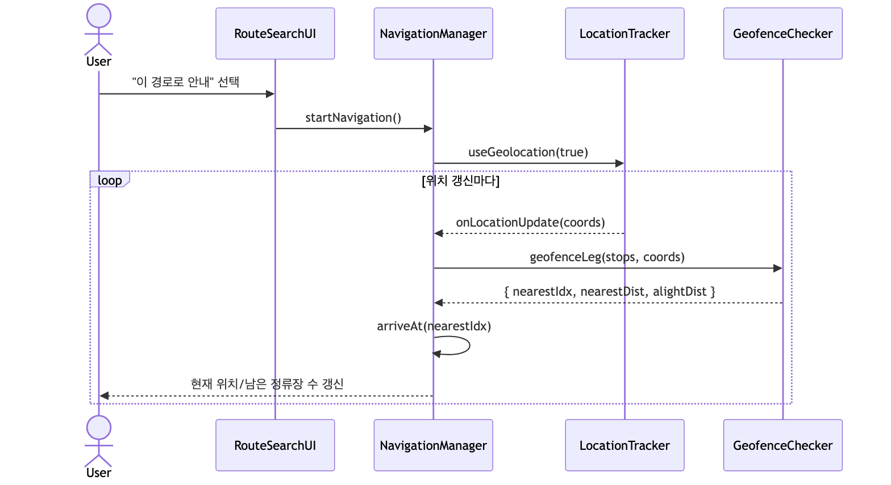
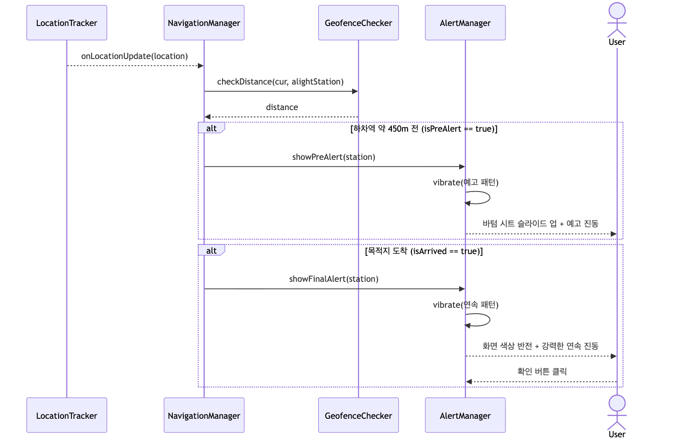
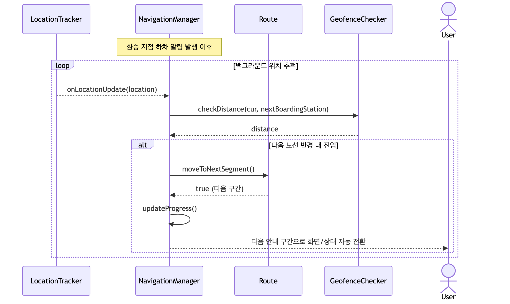
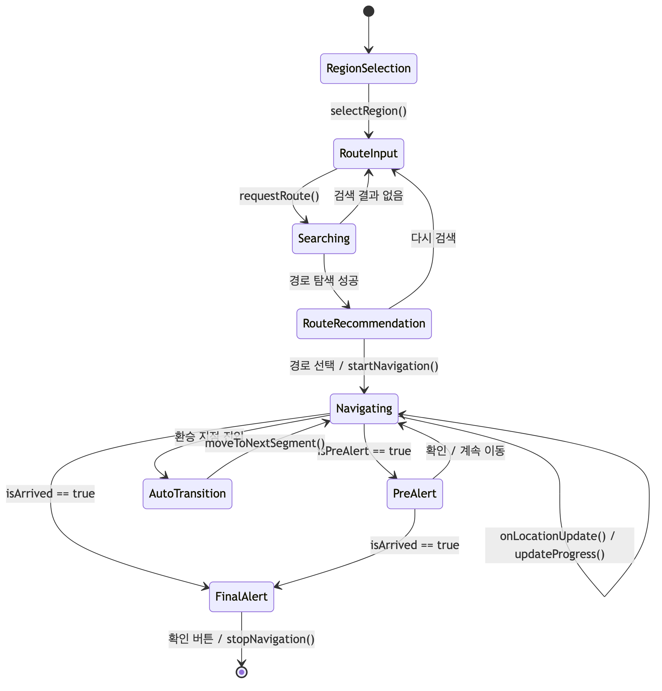

# [Design Report] 어르신 지상 대중교통 보조 시스템: 어디가수?

## Revision History

| Revision date | Version # | Description | Author |
| --- | --- | --- | --- |
| 2026-05-23 | 0.0.1 | 초기 설계 문서 작성 | 문찬주 |
| 2026-05-30 | 0.0.2 | 클래스 관계 설정 및 시퀀스 다이어그램 추가 | 문찬주 |
| 2026-06-04 | 0.0.3 | 상태 머신 다이어그램 및 구현 요구사항 정리 | 문찬주 |

---

## Contents

1. Introduction
2. Class Diagram
3. Sequence Diagram
4. State Machine Diagram
5. Implementation Requirements
6. Glossary
7. References

---

## 1. Introduction

우리는 목적지에 가기 위해 매일 대중교통을 이용한다. 그러나 신체적 노화로 주의력이 감소한 노인 사용자는 안내 방송을 놓치거나 복잡한 노선도에 당황하여 하차 시점을 놓치는 어려움을 자주 겪는다. 기존의 길찾기 앱은 대부분 젊은 층에 최적화되어 있어 노인 사용자가 직관적으로 하차 시점을 인지하기 어렵고, 지하 공간에서의 GPS 오차는 부정확한 정보를 제공할 위험이 크다.

이러한 문제를 해결하기 위해 우리는 위치 추적 신뢰도가 높은 **지상 대중교통**으로 범위를 한정하고, 노인의 인지 특성을 반영한 직관적인 UI와 강력한 진동 알림을 제공하는 시스템 **"어디가수?"**를 개발하였다. 이 시스템이 이루고자 하는 첫 번째 목표는 **하차 놓침 방지**이다. 실시간 GPS 위치와 목적지 좌표 사이의 거리를 계산하여 목적지 한 정거장 전과 도착 시점에 단계적으로 알림과 진동을 제공한다. 두 번째 목표는 **이동 부담 완화**이다. 환승 지점에서 사용자의 별도 조작 없이 위치 정보만으로 다음 안내 단계로 자동 전환하여, 복잡한 화면 조작 없이도 안내를 이어받을 수 있도록 한다.

주 타겟은 대중교통 이용 중 하차 정보를 놓치기 쉬운 노인 사용자이며, 현재는 대구·부산 지역의 지상 대중교통을 지원한다. 아래는 Analysis와 Conceptualization에 이은 이 System 개발의 세 번째 단계인 **Design**에 관한 내용으로서, 실제 System 구현에 직접적으로 관여하는 모든 요소들의 윤곽을 확정하고 구체적으로 디자인해 나가는 내용을 다룬다. 본 문서의 모든 세부 사항은 직접적인 구현 시 소스코드상에서의 용례와 일치함을 목적으로 한다.

---

## 2. Class Diagram

아래의 그림은 "어디가수?" 시스템의 Class Diagram을 표현한 그림이다.

아래의 표는 위의 Class Diagram에서 표현한 Class들에 대한 설명이다.

| Class Name | Explanation |
| --- | --- |
| **RegionSelector** | 앱 실행 시 서비스 가능 지역(대구, 부산 등)을 큰 버튼으로 보여주고 선택을 받는 클래스이다.  - `showRegions()` : 지원 지역 목록을 화면에 표시한다.  - `selectRegion(region)` : 사용자가 선택한 지역을 저장하고 다음 화면(RouteSearchUI)으로 이동한다. |
| **RouteSearchUI** | 출발지와 도착지를 입력받는 GUI 클래스이다. 입력 중 자동완성을 보여주고 최근 검색 목록을 제공한다.  - `onInput(keyword)` : 입력 키워드가 바뀔 때마다 LocationService에 후보 검색을 요청한다.  - `showAutoComplete(candidates)` : 검색된 역 후보 목록을 입력창 아래에 표시한다.  - `requestRoute(origin, dest)` : 출발/도착이 확정되면 RouteCalculator에 경로 탐색을 요청한다. |
| **LocationService** | 사용자가 입력한 텍스트(주소·역 이름)를 좌표로 변환(지오코딩)하고, 좌표를 역 정보로 변환(리버스 지오코딩)하는 클래스이다. 내부적으로 ApiClient를 사용한다. |
| **RouteCalculator** | 출발지·도착지 좌표를 기반으로 외부 API를 호출하여 지상 대중교통 중심의 경로를 탐색하는 클래스이다.  - `searchRoutes(origin, dest)` : 경로 후보들을 가져온다.  - `sortByTransfer(routes)` : 환승이 적은 순으로 정렬하여 노인 사용자가 보기 쉽게 한다. |
| **Route** | 전체 이동 경로 데이터를 담는 클래스이다. 여러 개의 RouteSegment(환승 구간)로 구성되며 현재 진행 중인 구간 인덱스를 가진다.  - `moveToNextSegment()` : 환승 지점 통과 시 다음 구간으로 전환한다.  - `isLastSegment()` : 마지막 구간(최종 목적지) 여부를 반환한다. |
| **RouteSegment** | 하나의 노선 탑승 구간을 나타내는 클래스이다. 탑승역, 하차역, 정류장 수, 노선명을 가진다. |
| **Station** | 알림과 자동 전환의 기준이 되는 지리적 지점(정류장/역)을 나타내는 클래스이다. 역 ID, 이름, 위도/경도, 지역 정보를 가진다. |
| **NavigationManager** | 실시간 안내의 핵심 클래스이다. LocationTracker로부터 위치를 받아 GeofenceChecker로 거리를 판단하고, 조건 충족 시 AlertManager로 알림을 발생시키며 진행 바를 갱신한다.  - `startNavigation()` : 위치 추적을 시작한다.  - `onLocationUpdate(loc)` : 위치가 갱신될 때마다 호출되어 거리 계산·알림·자동 전환을 수행한다. |
| **LocationTracker** | Geolocation API를 사용하여 실시간 GPS 위치를 추적하는 클래스이다. `startTracking()` 호출 시 위치 변경을 구독하고, 변경마다 NavigationManager에 알린다. |
| **Location** | 한 시점의 위도/경도와 타임스탬프를 담는 값 객체이다. |
| **GeofenceChecker** | 현재 위치와 목표 정류장 사이의 거리를 계산하고, 예고 알림(한 정거장 전)·도착 알림 조건을 판단하는 클래스이다. |
| **AlertManager** | 사용자에게 시각·촉각 피드백을 제공하는 클래스이다. 예고 알림(바텀 시트 슬라이드 업 + 예고 진동)과 최종 알림(화면 색상 반전 + 연속 진동)을 담당한다. |
| **Alert** | 사용자에게 표시되는 알림의 메시지·진동 패턴·종류를 담는 데이터 클래스이다. |
| **StorageManager** | Web Storage를 이용하여 최근 검색 역, 경로 데이터 등을 캐싱하고 불러오는 클래스이다. 네트워크가 불안정할 때 오프라인 모드를 지원한다. |
| **ApiClient** | 외부 API(ODsay, 지오코딩) 호출을 담당하는 공통 클래스이다. 호출 실패 시 `retry()`로 최대 3회 재시도한다. |

---

## 3. Sequence Diagram

아래에 나오는 그림들은 Analysis에서 표현한 핵심 Use Case들을 Sequence Diagram으로 표현한 그림들이다.

### 1) Search & Select Route (경로 검색 및 선택)

사용자가 출발지/도착지를 입력하면 LocationService가 좌표로 변환하고, RouteCalculator가 외부 API를 호출하여 경로를 탐색한 뒤 환승이 적은 순으로 정렬하여 보여준다.

### 2) Start Navigation & Track Location (안내 시작 및 위치 추적)

사용자가 경로를 선택하고 안내를 시작하면 NavigationManager가 LocationTracker를 가동하여 실시간 위치를 추적하고 진행 바를 갱신한다.

### 3) Provide Arrival Alert (도착 알림 - 지오펜싱)

실시간으로 계산된 거리가 임계값에 도달하면 단계적으로 예고 알림과 최종 알림을 발생시킨다.

### 4) Automatic Route Update (환승 자동 전환)

환승 지점 하차 알림 이후, 사용자의 별도 조작 없이 GPS 위치 변화만으로 다음 안내 구간으로 자동 전환한다.

---

## 4. State Machine Diagram

아래의 그림은 "어디가수?" 시스템의 State Machine Diagram을 표현한 그림이다.

아래는 위의 State Machine Diagram에 나온 각 State들에 대해 간단하게 설명한 표이다.

| Status | Explanation |
| --- | --- |
| **RegionSelection** | 앱이 실행된 직후 서비스 가능 지역을 선택하는 상태이다. 지역을 선택하면 RouteInput으로 전환된다. |
| **RouteInput** | 출발지와 도착지를 입력하는 상태이다. 입력 중 자동완성과 최근 검색을 제공한다. |
| **Searching** | 외부 API를 호출하여 경로를 탐색하는 상태이다. 결과가 없으면 RouteInput으로 되돌아가고, 성공하면 RouteRecommendation으로 간다. |
| **RouteRecommendation** | 탐색된 경로를 환승이 적은 순으로 정렬하여 보여주는 상태이다. 사용자가 경로를 선택하면 안내가 시작된다. |
| **Navigating** | 실시간 위치를 추적하며 진행 바와 남은 정류장 수를 갱신하는 핵심 상태이다. 위치 갱신 이벤트마다 거리를 판단한다. |
| **PreAlert** | 하차 한 정거장 전, 바텀 시트가 슬라이드 업되며 예고 진동을 발생시키는 상태이다. |
| **AutoTransition** | 환승이 포함된 경로에서 다음 노선 반경 진입을 감지하여 사용자 조작 없이 다음 구간으로 전환하는 상태이다. |
| **FinalAlert** | 목적지 도착 시 화면 색상을 반전하고 강력한 연속 진동을 발생시키는 상태이다. 사용자가 확인하면 안내가 종료된다. |

---

## 5. Implementation Requirements

"어디가수?" 시스템을 구동하기 위해 필요한 요구사항은 아래와 같다.

### 1) Hardware Requirements

| 항목 | 요구사항 |
| --- | --- |
| Device | GPS를 지원하는 스마트폰 (Android / iOS) 또는 위치 권한이 가능한 기기 |
| Sensor | GPS, 진동(Vibration) 모터 지원 |
| Network | 3G/LTE/Wi-Fi 등 데이터 통신 연결 필요 (오프라인 시 캐시 모드 제한 동작) |
| RAM | 2GByte 이상 권장 |

### 2) Software Requirements

| 항목 | 요구사항 |
| --- | --- |
| Operating System | Android 8.0 이상 / iOS 13 이상 |
| Runtime | 모던 웹 브라우저(Chrome, Safari) 또는 WebView 환경 |
| Implementation Language | JavaScript (ES6 이상) / HTML5 / CSS3 |
| Required API | W3C Geolocation API, Vibration API, Web Storage API |

### 3) Nonfunctional Requirements

- 본 시스템은 별도의 자체 서버 없이 외부 Open API(ODsay, 지오코딩)에 의존하여 경로·위치 데이터를 수집한다. 최근 검색 역 목록과 경로 데이터는 Web Storage(localStorage)에 캐싱되어 네트워크가 불안정할 때 일부 기능을 제공한다.
- 지하 구간 등 GPS 신뢰도가 낮은 환경을 고려하여 **지상 대중교통**으로 범위를 한정한다.
- 노인 사용자를 고려하여 큰 글씨, 단순한 화면, 강한 진동·색상 대비를 기본으로 한다.
- 외부 API 호출 실패 시 ApiClient는 최대 3회 재시도 후 오프라인 캐시 모드로 전환한다.
- 백그라운드 위치 추적은 OS 정책에 따라 제한될 수 있으므로, 화면 점유형 알림으로 보완한다.

---

## 6. Glossary

| Terms | Description |
| --- | --- |
| **Class Diagram** | 객체지향 시스템 설계에서 시스템의 논리 설계를 위한 클래스들의 존재와 그들의 관계를 도식으로 정의한 것. |
| **Sequence Diagram** | 객체들 사이에 주고받는 메시지의 시간 순서를 표현하여 기능의 동작 흐름을 보여주는 다이어그램. |
| **State Machine Diagram** | 시스템이 한정된 수의 상태로 구성됨을 전제로, 이벤트에 따른 상태 전이를 표현하여 동작을 설명하는 다이어그램. |
| **Geofencing** | 특정 위도/경도 반경 내 진입을 감지하여 알림을 트리거하는 가상 경계 기술. |
| **Geocoding** | 주소나 장소 이름을 위도/경도 좌표로 변환하는 것. 반대 변환은 Reverse Geocoding이라 한다. |
| **Bottom Sheet** | 화면 하단에서 위로 슬라이드되어 중요 정보를 전달하는 UI 컴포넌트. |
| **Auto-Transition** | 사용자 개입 없이 GPS 좌표 변화만으로 시스템 상태를 다음 단계로 전환하는 로직. |
| **메소드** | 멤버 함수라고도 하며, 객체지향 프로그래밍 언어에서 클래스 혹은 객체에 소속된 서브루틴을 가리킨다. |

---

## 7. References

1. **ODsay API** — 지상 대중교통 경로 및 위치 데이터 활용 가이드. https://www.odsay.com
2. **W3C – Geolocation API** — 실시간 좌표 수집 표준 명세. https://www.w3.org/TR/geolocation-API/
3. **MDN Web Docs – Vibration API** — 촉각 피드백 구현 지침. https://developer.mozilla.org/docs/Web/API/Vibration_API
4. **Google Web Storage** — 최근 검색 기록 및 사용자 설정 저장 방식. https://developers.google.com/web/fundamentals/instant-and-offline/web-storage
5. **SPARX SYSTEMS – State Machine Diagram Practice.** http://www.sparxsystems.com.au/resources/uml2_tutorial/uml2_statediagram.html
