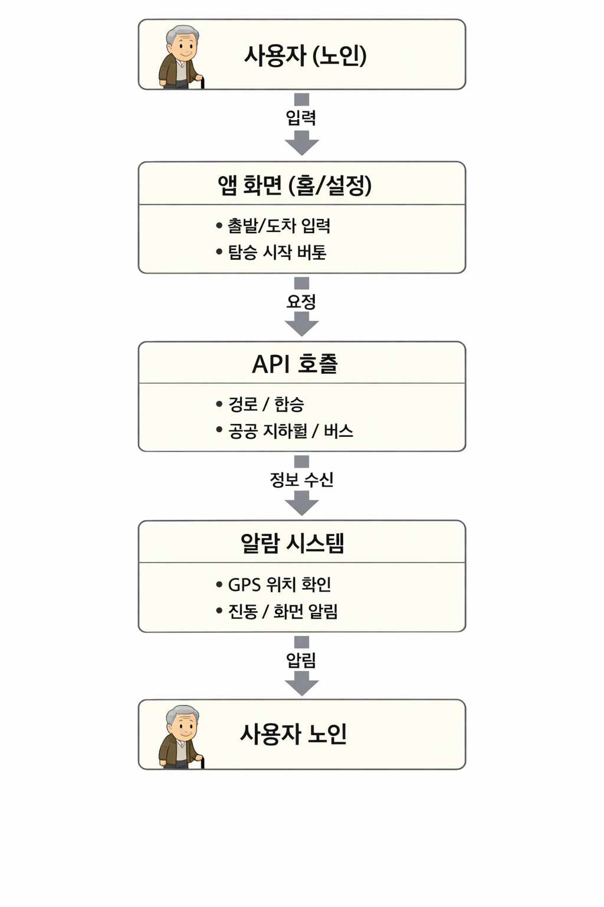
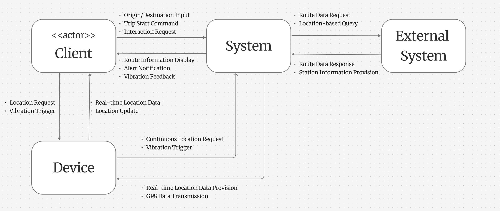

어디가수

# 1. Conceptualization

## Revision History

| Revision date | Version # | Description | Author |
|--------------|----------|------------|--------|
|              | 0.0.1    | First Documentation | |
|              |          |            | |
|              |          |            | |

---

## Contents

1. Business purpose  
2. System context diagram  
3. Use case list  
4. Concept of operation  
5. Problem statement  
6. Glossary  
7. References  

---

# 1. Business Purpose

## 1.1 Project Background

평소처럼 지하철을 타고 가던 어느 날, 바로 옆 노인 좌석에서 “어이쿠, 놓쳤다”라는 말이 들렸다.  
이 일을 계기로 노인들이 대중교통 이용 시 겪는 어려움을 인식하게 되었다.

“도착 정보를 미리 알려주는 알림만 있어도 되지 않을까?”라는 생각에서  
앱 **“어디가수?”**가 시작되었다.

어디가수는 사용자가 출발지와 도착지를 입력하면:

- Open API를 통해 위치 정보 변환
- 경로 탐색 수행
- 남은 정류장 수 제공
- 예상 도착 시간 제공
- 알림 및 진동 제공

을 통해 노인의 대중교통 이용을 돕는 앱이다.

### 구현 제약

- 백그라운드 알람 실행 제한  
- GPS 기반 자동 탑승 감지 어려움  
- 실시간 교통 정보 반영 한계  

따라서 프론트엔드에서 구현 가능한 기능에 집중한다.

---

## 1.2 Target Market

대중교통 이용 시 어려움을 겪는 노인 사용자

---

## 1.3 Goals

- 대중교통 노선 데이터를 활용한 최적 경로 계산  
- 현재 위치 기반 정류장 판단  
- 특정 조건에서 알림 발생  

---

# 2. System Context Diagram

### 주요 기능

- Origin/Destination Input : 출발지/도착지 입력  
- Trip Start Command : 탑승 시작  
- Interaction Request : 사용자 요청  
- Route Information Display : 경로 정보 표시  
- Current/Next Station Display : 현재/다음 정류장  
- Alert Notification : 알림 제공  
- Vibration Feedback : 진동 제공  

---

# 3. Use Case List

## 1) Input Route

| Actor | User |
|------|------|
| Description | 사용자는 출발지와 도착지를 입력하고 시스템은 이를 위치 정보로 변환한다 |

---

## 2) Calculate Route

| Actor | System |
|------|--------|
| Description | 외부 API를 통해 최적 경로 및 환승 정보를 계산한다 |

---

## 3) Start Navigation

| Actor | User |
|------|------|
| Description | 사용자가 탑승 시작 버튼을 누르면 위치 추적이 시작된다 |

---

## 4) Track Location

| Actor | System / Device |
|------|----------------|
| Description | GPS를 활용하여 위치를 추적하고 정류장을 판단한다 |

---

## 5) Provide Alert

| Actor | System |
|------|--------|
| Description | 목적지 근접 시 알림을 제공한다 |

---

## 6) Display Route Info

| Actor | System |
|------|--------|
| Description | 현재 위치, 다음 정류장, 남은 정류장 수 등을 표시한다 |

---

# 4. Concept of Operation

## 1) Input Origin/Destination

| 항목 | 내용 |
|------|------|
| Purpose | 출발지와 도착지를 설정 |
| Approach | 입력 → API 호출 → 좌표 변환 |
| Dynamics | 경로 탐색 시 발생 |
| Goals | 정확한 위치 확보 |

---

## 2) Calculate Route

| 항목 | 내용 |
|------|------|
| Purpose | 최적 경로 제공 |
| Approach | API 호출 → 경로 데이터 수집 |
| Dynamics | 입력 후 자동 실행 |
| Goals | 이해하기 쉬운 경로 제공 |

---

## 3) Start Trip

| 항목 | 내용 |
|------|------|
| Purpose | 안내 시작 |
| Approach | 버튼 클릭 → 위치 추적 시작 |
| Dynamics | 이동 시작 시 |
| Goals | 정확한 안내 시작 |

---

## 4) Track Location

| 항목 | 내용 |
|------|------|
| Purpose | 위치 기반 이동 상태 파악 |
| Approach | GPS 데이터 수집 |
| Dynamics | 이동 중 지속 |
| Goals | 실시간 정보 반영 |

---

## 5) Provide Route Information

| 항목 | 내용 |
|------|------|
| Purpose | 이동 정보 제공 |
| Approach | 현재 위치 및 정류장 정보 표시 |
| Dynamics | 실시간 업데이트 |
| Goals | 직관적인 정보 제공 |

---

## 6) Alert Notification

| 항목 | 내용 |
|------|------|
| Purpose | 하차 시점 알림 |
| Approach | 거리/정류장 기준 알림 |
| Dynamics | 목적지 근접 시 |
| Goals | 하차 놓침 방지 |

---

# 5. Problem Statement

## 1) 백그라운드 실행 제한

웹 환경에서는 앱이 비활성화되면 기능이 중단될 수 있다.

## 2) GPS 위치 정확도 문제

지하철, 터널 등에서 위치 오차가 발생한다.

## 3) 외부 API 의존성

API 호출 제한, 지연, 데이터 부정확성 문제가 있다.

## 4) 사용자 상태 판단 문제

실제 탑승 여부를 정확히 판단하기 어렵다.

---

# 6. Glossary

| 용어 | 설명 |
|------|------|
| Origin | 출발 위치 |
| Destination | 도착 위치 |
| Route | 이동 경로 |
| Location Data | 위치 정보 |
| Tracking | 위치 추적 |
| External API | 외부 서비스 |
| Alert | 알림 |

---

# 7. References

1. ODsay API  
   https://www.odsay.com  

2. W3C – Geolocation API  
   https://www.w3.org/TR/geolocation-API/  

3. Google Web Storage  
   https://developers.google.com/web/fundamentals/instant-and-offline/web-storage  